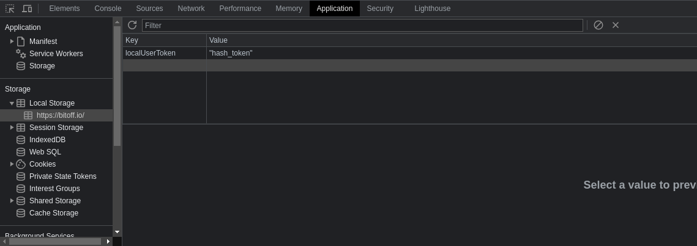
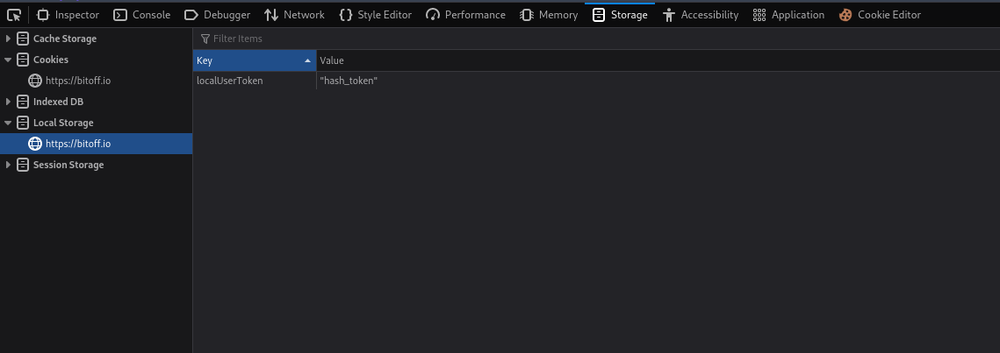
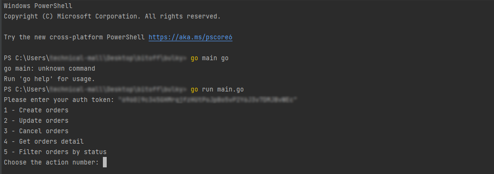

# Bulky

Bulky is a command line tool for bulk order management. This CLI tool is for Bitoff.io

## Requirements
- `Git`
  - macOS: `brew install git`
  - Windows: `https://git-scm.com/download/win`
- `Golang`
  - macOS: `brew install go`
  - Windows: `https://go.dev/dl`

## Installation
After installing golang compiler on your machine, you need run the following commands to install bulky:
- `git clone https://github.com/bitoffgit/bulky`
- `cd bulky`
- `sh bin/install.sh`

## Authentication
1. Log in to your account on [Bitoff.io](https://bitoff.io)
2. In your Chrome browser's web inspector, look for the `localUserToken` in local storage and copy the contents. 
3. In your Firefox browser's web inspector, look for the `localUserToken` in local storage and copy the contents. 
4. This token will be used on the command line when using bulky.

## Usage
To create, update or cancel orders, just execute bulky CLI  
